# №1

### Per base sequence content
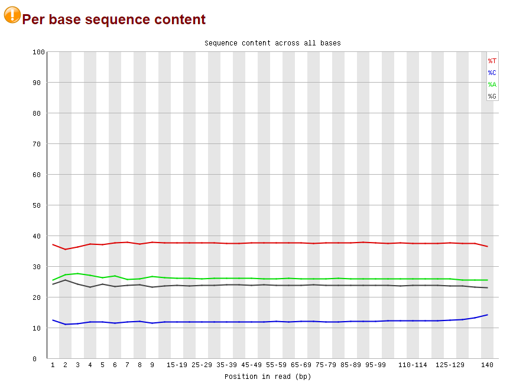
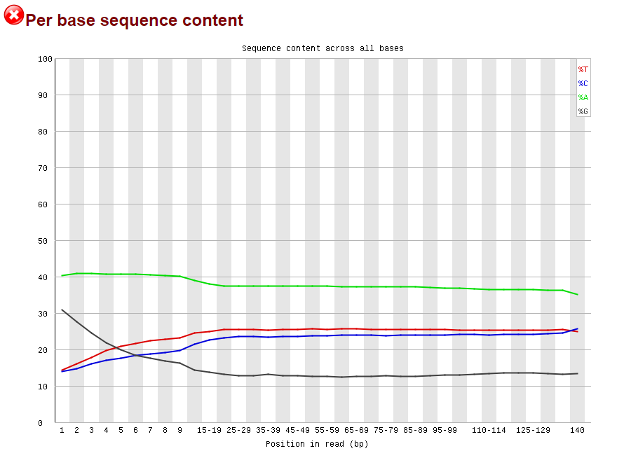


Графики SRR5836473_1 и SRR3414630_1 имеют разные характеристики:
- В графике SRR5836473_1 содержание Цитозина (С) почти отсутствует или очень низкое, в то время как содержание Тимина (Т) соотносительно высокое. Содержание Гуанина (G) и Аденина (А) примерно одинаково и находится на среднем уровне по сравнению с графиком SRR3414630_1.

## Per sequence GC content
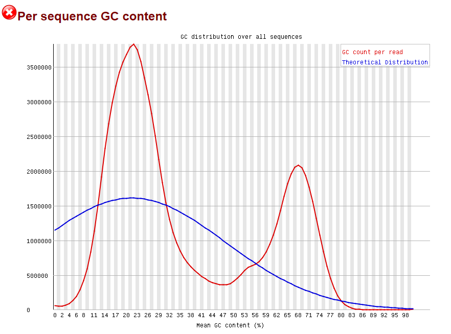
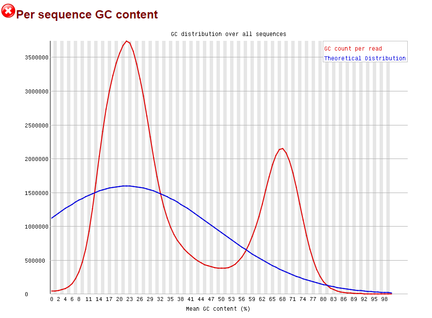


Можно сделать вывод, что нблюдается нормальное смещенное распределение

# №2

## Таблица с числм ридов, закартированных на участках 11347700-11367700; 40185800-40195800 и процентом дуплицированных прочтений для каждого образца

### Число ридов
BS-Seq | ch11: 11347700-11367700 | ch11: 40185800-40195800 | deduplication 
--- | --- | --- | ---
SRR5836473 | 1090 | 464 | 81.69
SRR3824222 | 2328 | 1062 | 97.08
SRR5836475 | 1456 | 630 | 90.92

## bash-script
```
!ls *pe.bam | xargs -P 4 -tI{} deduplicate_bismark  --bam  --paired  -o s_{} {}
```

## M-bias графики

На диаграммах показаны уровни метилирования для каждой позиции в прочтении. Значение Methylation calls отображается по оси Y слева, а пропорция метилирования - по оси Y справа. Поскольку у нас есть парные записи, то каждый запуск представлен двумя отдельными графиками

### SRR3824222

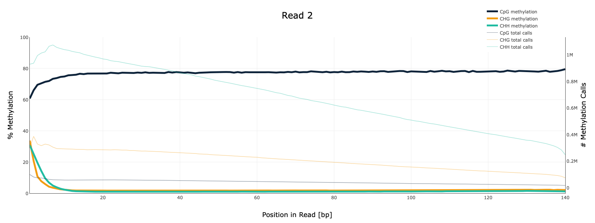 

### SRR5836473
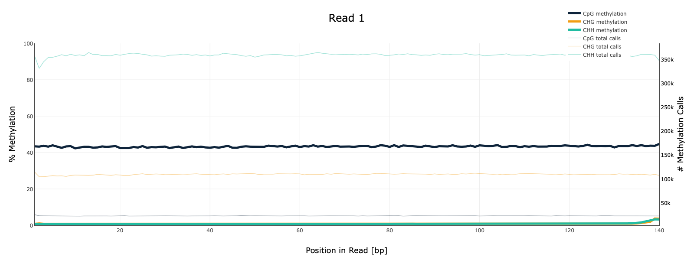
 

### SRR5836475
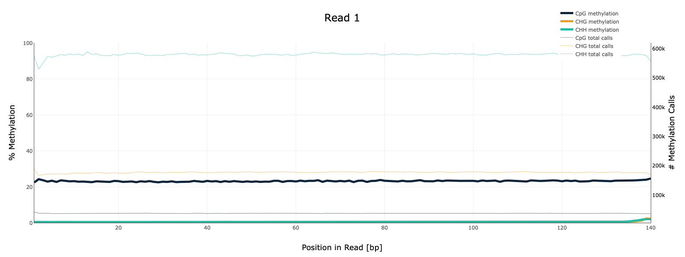
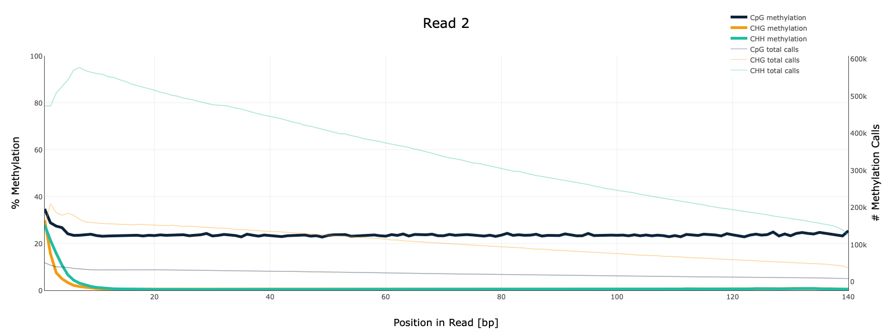 

## Метилирование цитозинов по хромосоме

Результаты показывают, что частота и процент метилляции различаются для каждого образца. В первом образце чаще всего не метилируется ни один цитозин в 40% случаев. Во втором образце наиболее часто происходит полная метилляция (100%), что является хорошим показателем, так как это влияет на экспрессию гена. В третьем образце чаще всего не метилируется около 60% цитозинов.

### SRR3824222 (Epiblast)
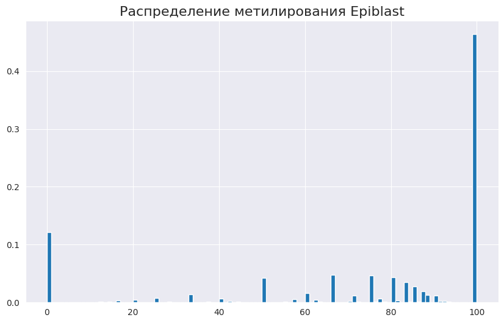
### SRR5836473 (8 Cell)
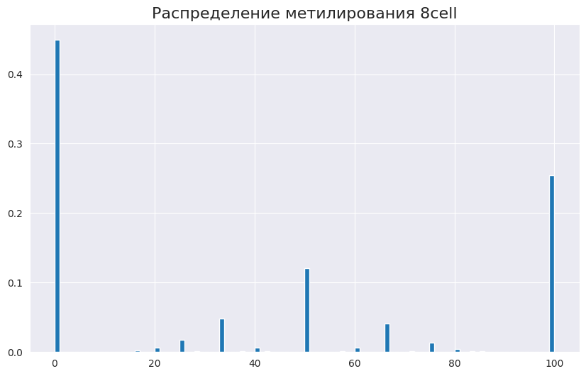
### SRR5836475 (ICM)
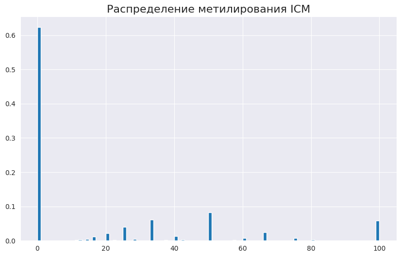

## Уровень метилирования и покрытия для каждого образца

### Уровень метилирования
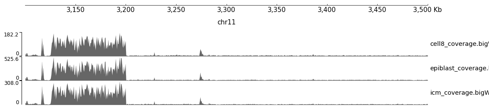
### Уровень покрытия


